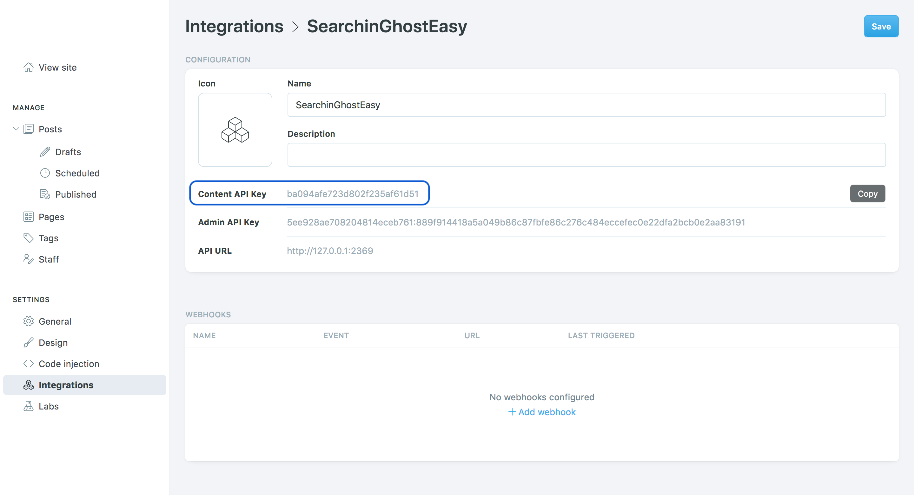
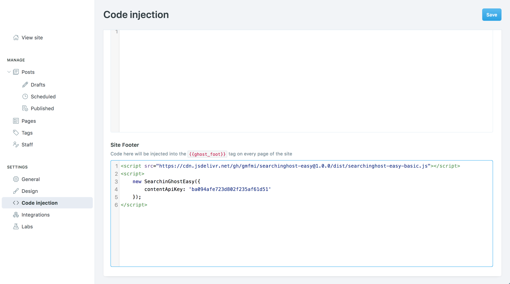

[](https://github.com/gmfmi/searchinghost-easy/releases)
[](https://www.jsdelivr.com/package/gh/gmfmi/searchinghost-easy)
[](https://github.com/gmfmi/searchinghost-easy/blob/master/LICENSE)


# SearchinGhostEasy

Beautiful search bars made accessible to any Ghost CMS user

## Description


## Installation

1. First, create a "custom integration". On the left side, go to the "integration" section, click on "Add custom integration" and give it the name "SearchinGhostEasy".
Now, copy the "Content API Key", we will need it for the next step.
If you need more help, visit the official [Ghost custom integration](https://ghost.org/integrations/custom-integrations/) page.



2. Then, from the "Code Injection" section, copy and paste the following code chunk. The one from the screenshot is probably outdated. DO NOT FORGET to replace the `<CONTENT_API_KEY>` placeholder with your own API key. Click on "save".  
*note: various search box templates are available, see the [templates section](#search-templates) below.*

```html
<script src="https://cdn.jsdelivr.net/gh/gmfmi/searchinghost-easy@0.1.2/dist/searchinghost-easy-basic.js"></script>
<script>
    new SearchinGhostEasy({
        contentApiKey: '<CONTENT_API_KEY>'
    });
</script>
```



3. Finally, add a link in the menu that open the search box. To do so, go to the "Design" section and add a new item. It can be in the "navigation" or "secondary navigation". You can name it with any label (but "Search" feels natural) but the link **must** ends with `#searchinghost-easy`. Click on "save".


This is it, everything is setup! On you blog, a "search" button should shows up in the menu. Click it to see the magic happens! 😃


## Search Templates

SearchinGhostEasy comes in various graphical flavors. The one provided by default is called "Basic" but you
can easily switch between all the available templates.

To do so, refer to each template description and copy/paste the associated code chunk into your blog
`Code Injection > Site Footer` section. Basically, only the last part of the script name changes
(e.g. "searchinghost-easy-basic.js", "searchinghost-easy-backpack.js", ...).

### ✏️ Basic template

#### Screenshot


#### Demo

Live demo: https://gmfmi.github.io/searchinghost-easy/basic/


#### Installation

```html
<script src="https://cdn.jsdelivr.net/gh/gmfmi/searchinghost-easy@0.1.2/dist/searchinghost-easy-basic.js"></script>
<script>
    new SearchinGhostEasy({
        contentApiKey: '<CONTENT_API_KEY>'
    });
</script>
```


### ✏️ Backpack template

#### Screenshot


#### Demo

Live demo: https://gmfmi.github.io/searchinghost-easy/backpack/


#### Installation

```html
<script src="https://cdn.jsdelivr.net/gh/gmfmi/searchinghost-easy@0.1.2/dist/searchinghost-easy-backpack.js"></script>
<script>
    new SearchinGhostEasy({
        contentApiKey: '<CONTENT_API_KEY>'
    });
</script>
```


## Configuration

The default configuration parameters are carefully chosen so most of users only need to set the `contentApiKey`.
For more advanced scenarios, here are the available options:

```js
new SearchinGhostEasy({
    contentApiKey: '<CONTENT_API_KEY>', // mandatory
    apiUrl: 'http://example.com',
    searchinghostOptions: {},
    searchinghostVersion: '1.3.3',
    debug: false
});
```

- **contentApiKey** (string, mandatory)
> The content API key. This value is mandatory and can be found in the custom integration details.
>
> example: `'06a02026a9f2dcf69f7e065d7c'`

- **apiUrl** (string)
> Set an API url different from the blog domain name. Can be useful for testing purpose.
> This options corresponds to `url` in the SearchinGhost library.
>
> example: `'http://example.com'`

- **searchinghostOptions** (object)
> Override SearchinGhost default configuration. This configuration will be merged with the
> ones provided by SearchinGhostEasy itself and the selected search template.
>
> example:
> ```js
> {
>     searchOn: 'submit',
>     limit: 5,
>     cacheMaxAge: 3600,
> }
> ```

- **searchinghostVersion** (string)
> Set the SearchinGhost version to use. Can be useful if a newer version has just been released.
>
> example: `'1.3.0'`

- **debug** (boolean)
> Set it to `true` to enable the debug mode. This will output the final SearchinGhost configuration used
> and also enable debug for SearchinGhost.
>
> default: `false`
